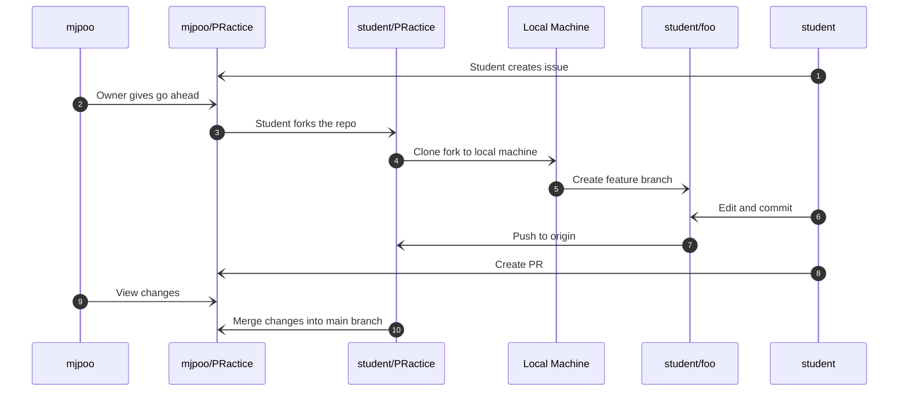

# PRactice
An extremely basic project to allow students practice in creating issues, branching, pull requests and code reviews.

## Github Page
The contents of the `docs` folder are being used as a dist for the https://mjpoo.github.io/PRactice/ site. This uses these [Actions](https://github.com/mjpoo/PRactice/actions/).

## Master Branch
A public repo has been set up at https://github.com/mjpoo/PRactice.
This is the main home of the project

## Collaborators
Any Github user can submit and issue or a PR so this is the approach we will use.
Collaborators are not required for this project, indeed it sort of defeats the idea of having to request a PR if they can just go ahead and edit the main branch.

## Issues
Anyone can add an issue to the project.
Issues will appear at https://github.com/mjpoo/PRactice/issues.

Step 1 = The student should follow the repo's contribution guidelines by either creating an issue for a feature they think the site should have or responding to an open issue saying they wish to tackle it. 

Top tip = include `@mjpoo` in the comment to attract his attention.

Step 2 = Mjpoo will reply in the issue saying they are happy for the student to go ahead with the change. He may assign the issue to the student.

## Forking and Cloning
Step 3 = The student should create a new fork of the [main branch](https://github.com/mjpoo/PRactice) in their own Github account (e.g. https://github.com/studentname/PRactice)

Step 4 = The student clones (downloads) the fork to their local machine (e.g. in VS Code) using `git clone https://github.com/student/PRactice`).

## Editing
Step 5 = The student creates a new branch with the name of the new feature e.g. `git branch foo` and then switches/checkouts that branch e.g. `git checkout foo`

Step 6 = The student edits it there and commits the changes e.g. `git commit -m "Did stuff"` to the feature branch.

Step 7 = Push the files to the repo e.g. `git push origin foo`

Optional Step = Would be useful for the student to view their change at https://studentname.github.io/PRactice/

## Pull Requests (PRs)
Step 8 = When the student is happy with the change they submit a PR by using "Compare & Pull Request" button, filling in the details and then clicking "Create pull request". The PR will then appear in the (Pull Request list)[https://github.com/mjpoo/PRactice/pulls].

Step 9 = Mjpoo will then view the changed files and test the change. 

Step 10 = Mjpoo merges it with the main branch if all is well.

## Code Review
It would be nice to also practice code reviews in this exercise although that will mean complicating it slightly by adding collaborators.

## VS Code Extensions
There is no need to install the new (GitHub Repositories)[https://marketplace.visualstudio.com/items?itemName=github.remotehub] or the older (GitHub Pull Requests)[https://marketplace.visualstudio.com/items?itemName=GitHub.vscode-pull-request-github] extensions into VS Code although they do make life easier. 

This exercise will work using the source control feature (which requires a local version of the repo unlike the new GitHub extension which does not).